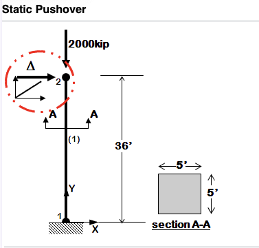

Elastic Column Pushover
-----------------------

This is a very simple example of an elastic column subjected to pushover. Its purpose is to provide a basic introduction to OpenSees. 

To run the example download the script, start OpenSees, cd to the directory containing the example and type

.. code-block:: bash

   cd C:\Users\fmckenna\examples\
   source example.tcl

The file can be :download:`downloaded <tclCode/example.tcl>`. The contents of the downloaded file is as shown below:

  .. literalinclude:: tclCode/example.tcl
      :language: tcl
      :linenos:

